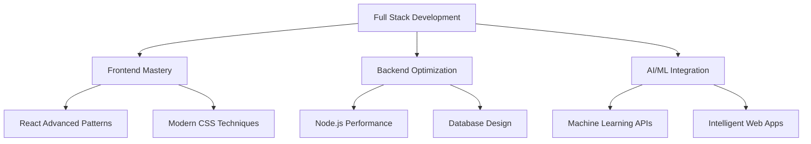

# 👋 Hi, I'm Rampradop

<div align="center">
  
</div>

## 🎯 About Me

- 🔭 I'm currently working on **building full-stack web applications with modern frameworks**
- 🌱 I'm currently learning **advanced React patterns and Node.js optimization**
- 👯 I'm looking to collaborate on **open-source projects** 
- 💬 Ask me about **React, Node.js, or web development best practices**
- 📫 How to reach me: **rampradops28@gmail.com**
- 😄 Pronouns: **He/Him**
- ⚡ Fun fact: **I debug with console.log() like a pro!**

## 🚀 What I Do

```javascript
const rampradop = {
    role: "Full Stack Developer",
    passions: ["Web Design", "AI Technologies", "Problem Solving"],
    currentFocus: "Building scalable web applications",
    learningStyle: "Self-taught & Curious Explorer",
    motto: "Always ready to learn new tools & frameworks"
};
```

## 🛠️ Tech Stack

### Frontend


### Backend


### Tools & Technologies


## 📊 GitHub Stats

<div align="center">
  
</div>

<div align="center">
  
</div>

<div align="center">
  
</div>

## 🏆 GitHub Trophies

<div align="center">
  
</div>

## 📈 Contribution Graph

<div align="center">
  
</div>

## 🎯 Current Focus



## 🌟 Featured Projects

### 🚀 Project Highlights
- **Modern Web Applications**: Building responsive, user-friendly interfaces
- **Full-Stack Solutions**: End-to-end development with modern tech stack
- **Open Source Contributions**: Contributing to the developer community
- **AI Integration**: Exploring machine learning in web development

## 📫 Let's Connect

<div align="center">
  
[](mailto:rampradops28@gmail.com)
[](https://linkedin.com/in/rampradops28)
[](https://github.com/rampradops28)

</div>

## 💭 Quote

<div align="center">
  
</div>

---

<div align="center">
  
</div>

<div align="center">
  
### 🚀 "Building the future, one commit at a time"

</div>

---

<div align="center">
  
</div>
